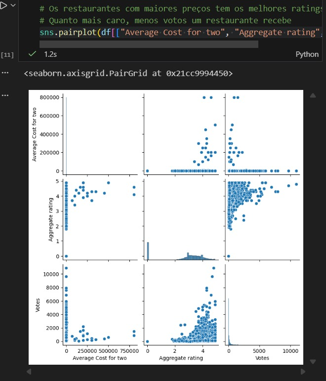
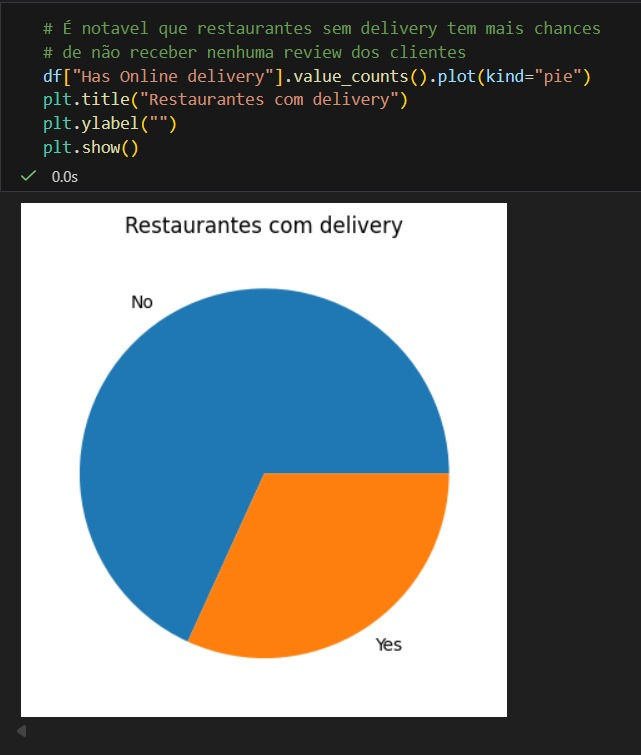

# Previsor de Avaliação de Restaurantes com Machine Learning
Este projeto usa técnicas de Machine Learning e Mineração de Dados para prever a avaliação que restaurantes receberram dos clientes e seu desempenho de acordo com diversas métricas, auxiliando gestores na tomada de decisões estratégicas. O projeto é focado em aprendizado supervisionado, empregando as seguintes técnicas:
- Regressão Linear
- Support Vector Machine
- Arvores de Decisão
- Random Forest
- K-Nearest Neighbors

Ao utilizar técnicas de Machine Learning e Mineração de Dados, o sistema pode identificar padrões de comportamento dos clientes, antecipar a satisfação do público e apoiar melhorias em serviços, preços, cardápio e logística. Com isso, tem a capacidade de se tornar uma ferramenta valiosa para otimizar a competitividade dos restaurantes e aumentar a qualidade do atendimento oferecido. 

## Estrutura  
O passo a passo do desenvolvimento do projeto e os estudos por dele podem ser visualizados no arquivo Jupyter Notebook "src/notebook.ipynb", isto inclue:
- O processo de ETL e limpeza do dataset
- Gráficos e visualizações dos dados

  

- Analise e interpretação do desempenho do modelo e dos dados em questão

  

Como exemplo das conclusões obtidas na analise dos dados: Restaurantes que fornecem serviços de delivery recebem reviews mais positivas dos clientes, tem um custo-beneficio maior e mais chances de receberem avaliações e indicações.  

O sistema utiliza uma interface gerada pela biblitoeca **streamlit**, o código fonte se encontra no arquivo "src/app.py" e pode ser inicializado com o comando:

`streamlit run src/app.py`  

Demosntração da interface:
  
  
## Técnologias Utilizadas
- O modelo foi treinado utilizando um dataset com quase 10 mil entradas de restaurantes do mundo todo, a base de dados foi fornecida pela [Kaggle](https://www.kaggle.com/datasets/mohdshahnawazaadil/restaurant-dataset?resource=download)
- O sistema depende de um ambiente utilizando **Python 3.11**;
- Técnologias de Machine Learning foram empregadas utilizando a biblioteca **sklearn**.

Autores: Nathan Marques Silva e Bruna Cristina Mafra
